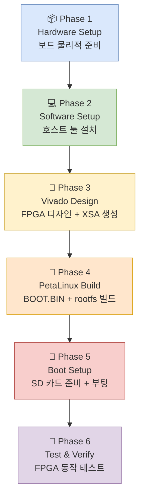

# VPK180 Bringup Overview

> **목표**: VPK180에 FPGA binary(PDI)를 올리고 PetaLinux(APU Cortex-A72) 환경에서 테스트를 수행한다.

## 시스템 구성 요약

| 항목 | 내용 |
|------|------|
| 보드 | AMD VPK180 Evaluation Board |
| 메인 디바이스 | XCVP1802 Versal Premium SoC |
| 프로세서 | APU: Cortex-A72 ×2 / RPU: Cortex-R5F ×2 |
| 메모리 | LPDDR4 12GB (3채널 × 4GB) |
| System Controller | XCZU4EG (Zynq UltraScale+) |
| OS | PetaLinux (Yocto 기반) |
| FPGA 툴 | Vivado 2025.2 + PetaLinux 2025.2 |

## 단계별 작업 흐름

## 문서 목록

| 문서 | 내용 |
|------|------|
| [01-hardware-setup.md](01-hardware-setup.md) | Phase 1: 보드 물리적 준비, 스위치/점퍼 설정 |
| [02-software-setup.md](02-software-setup.md) | Phase 2: 호스트 OS, Vivado/PetaLinux 설치 |
| [03-vivado-design.md](03-vivado-design.md) | Phase 3: Vivado 블록 디자인, XSA 생성 |
| [04-petalinux-build.md](04-petalinux-build.md) | Phase 4: PetaLinux 빌드, BOOT.BIN 패키징 |
| [05-boot-test.md](05-boot-test.md) | Phase 5-6: 부팅, FPGA 로드, 테스트 |
| [codex-review.md](codex-review.md) | Codex 점검: 리스크·체크리스트·권고사항 |

## 다이어그램

| 파일 | 내용 |
|------|------|
| [diagrams/system-architecture.drawio](diagrams/system-architecture.drawio) | VPK180 시스템 블록 다이어그램 |
| [diagrams/boot-flow.drawio](diagrams/boot-flow.drawio) | 부트 시퀀스 플로우 |
| [diagrams/jtag-chain.drawio](diagrams/jtag-chain.drawio) | JTAG 디버그 체인 구성 |

## 주요 주의사항

> ⚠️ **System Controller(XCZU4EG) 펌웨어 절대 수정 금지** — 잘못된 펌웨어 로드 시 보드 영구 손상 가능
>
> ⚠️ **툴 버전 반드시 일치** — PetaLinux 버전 = Vivado 버전 (현재: 2025.2)
>
> ⚠️ **BSP 방식 사용 권장** — `--template versal` 대신 AMD 공식 VPK180 BSP 파일로 프로젝트 생성

## 참고 문서

| AMD 문서 번호 | 제목 |
|---|---|
| UG1582 | VPK180 Evaluation Board User Guide |
| UG1144 | PetaLinux Tools Reference Guide |
| AM011 | Versal Adaptive SoC Technical Reference Manual |
| UG908 | Vivado Programming and Debugging |
| XTP729 | VPK180 System Controller Tutorial |
| UG1514 | SmartLynq+ Module User Guide |
