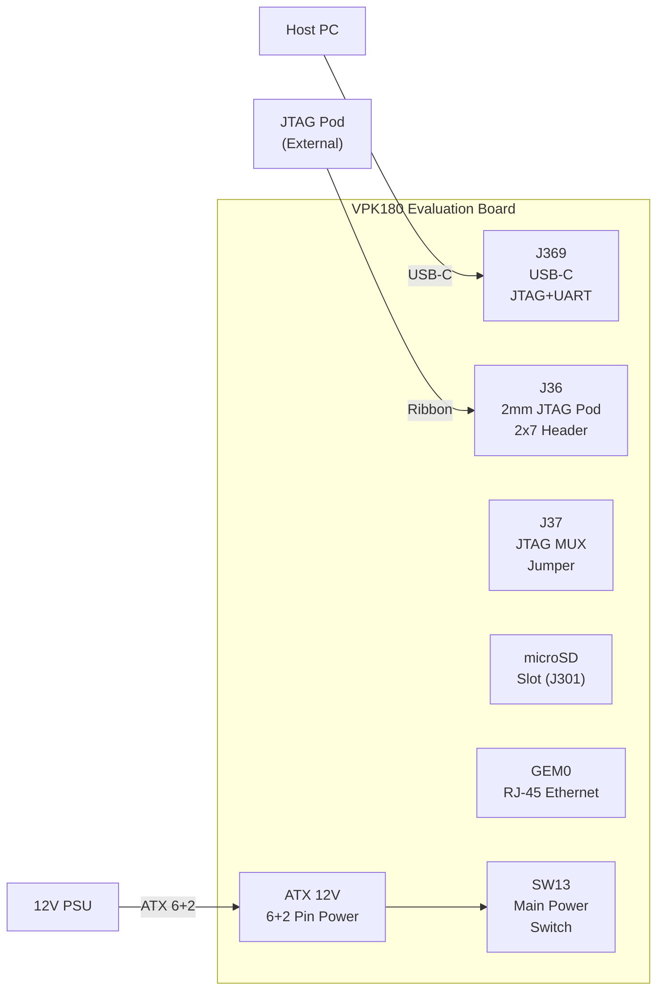

# Phase 1 — Hardware Setup

> 보드를 처음 통전하기 전 물리적 점검과 스위치·점퍼 설정을 완료한다.

## 체크리스트

- [ ] 보드 외관 검사 (손상, 이물질 없음)
- [ ] ATX 12V (6+2 핀) 전원 케이블 확인
- [ ] USB-C 케이블 (J369) 준비
- [ ] microSD 카드 준비 (16GB 이상, Class 10)
- [ ] 호스트 PC와 연결 케이블 준비
- [ ] 작업 환경 확인 (온도 0~45°C, 정전기 방지)

---

## 보드 커넥터 위치



---

## DIP 스위치 설정

### SW1 — Versal 부트 모드 (4-pole)

> 규칙: **ON = Logic 0** (pull-down), **OFF = Logic 1** (pull-up)

| 부트 모드 | SW1[1] | SW1[2] | SW1[3] | SW1[4] | 용도 |
|-----------|--------|--------|--------|--------|------|
| **JTAG** (기본값) | ON | ON | ON | ON | 초기 개발/디버그 |
| **SD1 (3.0)** | ON | OFF | OFF | OFF | SD 카드 부팅 |
| QSPI32 | ON | OFF | ON | ON | QSPI 플래시 부팅 |

### SW3 — JTAG 소스 선택 (2-pole)

| 소스 | SW3[1] | SW3[2] | 용도 |
|------|--------|--------|------|
| **FTDI JTAG** (기본값) | OFF | ON | USB-C J369 사용 |
| 외부 JTAG Pod | ON | ON | J36 포드 사용 |

### SW11 — System Controller 부트 모드 (4-pole)

| 모드 | SW11 설정 | 비고 |
|------|-----------|------|
| **QSPI32** (기본값) | ON-OFF-ON-ON | 수정 금지 |

### 기타 스위치

| 스위치 | 기본값 | 기능 |
|--------|--------|------|
| SW2 | Open | VPK180 POR_B 리셋 |
| SW6 (4-pole) | All OFF | User GPIO DIP |
| SW13 | **OFF** | 메인 전원 ON/OFF |
| SW14 | Open | USB 리셋 |
| SW15 | Open | GEM 리셋 |

---

## 점퍼 설정 (기본값 유지)

| 점퍼 | 기본 설정 | 기능 |
|------|-----------|------|
| J12 | Open | SYSMON 헤더 |
| J26 | Pins 1-2 | POR_B supervisor sense |
| J34 | Pins 2-3 | VCC fuse 프로그래밍 **비활성화** |
| **J37** | Pins 2-3 | JTAG → FT4232 (USB-C J369) |
| J301 | Pins 1-2 | SD 기준 전압 3.3V |
| J347 | Pins 1-2 | Fan PWM (System Controller 제어) |

---

## 전원 연결

```
ATX 12V PSU
└── 6+2 핀 커넥터 → VPK180 ATX 소켓
    └── SW13 (메인 전원) OFF 상태 확인 후 연결
        └── 모든 설정 완료 후 SW13 ON
```

**주요 전원 레일** (참고용):

| 레일 | 전압 | 용도 |
|------|------|------|
| VCCINT | 0.8V / 300A | Versal 코어 |
| VCC_SOC | 0.8V / 34A | SoC |
| VCCAUX | 1.5V / 18A | AUX |
| VADJ_FMC | 1.5V / 6A | FMC+ 뱅크 709-710 |
| MGTAVTT | 1.2V | GT 트랜시버 |

---

## UART 연결 확인

USB-C J369 연결 후 호스트 PC에서 2개의 COM 포트가 나타남:
- **1번 COM**: JTAG (Vivado Hardware Manager 연결용)
- **2번 COM**: UART (터미널 — **115200 8N1**)

```bash
# Linux에서 포트 확인
ls /dev/ttyUSB*
# 또는
dmesg | grep ttyUSB
```

---

## 참고

- [UG1582 Board Setup](https://docs.amd.com/r/en-US/ug1582-vpk180-eval-bd/Board-Setup)
- [JTAG 디버거 목록](../jtag/supported-debuggers.md)
- [시스템 아키텍처 다이어그램](diagrams/system-architecture.drawio)
