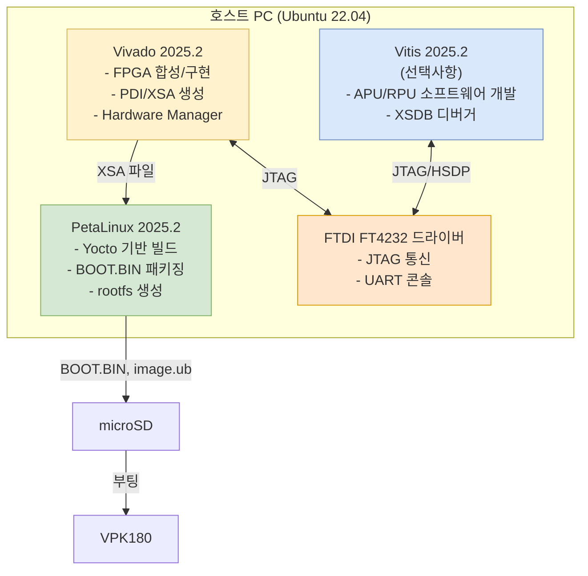

# Phase 2 — Software Setup

> 호스트 PC에 Vivado, PetaLinux, 드라이버를 설치하고 빌드 환경을 구성한다.

## 체크리스트

- [ ] Ubuntu 22.04 LTS 호스트 준비
- [ ] bash 기본 셸 설정
- [ ] Vivado 2025.2 설치
- [ ] PetaLinux 2025.2 설치
- [ ] FTDI 드라이버 설치
- [ ] 터미널 에뮬레이터 설치
- [ ] 환경 변수 설정 확인

---

## 툴체인 구성



---

## 버전 호환 매트릭스

| 툴 | 버전 | 비고 |
|----|------|------|
| **Vivado Design Suite** | **2025.2** | PetaLinux와 반드시 동일 버전 |
| **PetaLinux** | **2025.2** | Vivado와 반드시 동일 버전 |
| Vitis | 2025.2 | 선택사항 |

> ⚠️ **크로스 버전 사용 불가** — PetaLinux 2025.2는 Vivado 2025.2 생성 XSA만 지원

---

## 호스트 OS 요구사항

### 지원 OS

| OS | 버전 | 권장 |
|----|------|------|
| **Ubuntu** | 22.04.3 / 22.04.4 / 22.04.5 LTS | ✅ 권장 |
| OpenSUSE Leap | 15.4 | ○ |
| AlmaLinux | 8.10, 9.4, 9.5 | ○ |
| CentOS/RHEL | — | ❌ 2025.2 제거됨 |
| Windows | — | ❌ PetaLinux 미지원 |

### 하드웨어 요구사항

| 항목 | 최소 | 권장 |
|------|------|------|
| RAM | 8 GB | 16 GB 이상 |
| CPU | 2 GHz, 8 코어 | 16 코어 이상 |
| 디스크 | 100 GB 여유 | 200 GB 이상 |

---

## 1. Ubuntu 22.04 기본 설정

```bash
# bash 기본 셸 설정 (PetaLinux 필수 요구사항)
sudo dpkg-reconfigure dash
# → "dash as /bin/sh?" → No 선택

# 기본 의존성 설치
sudo apt update && sudo apt install -y \
    build-essential gcc g++ git make \
    libssl-dev libncurses5-dev flex bison \
    u-boot-tools device-tree-compiler \
    python3 python3-pip \
    gawk wget diffstat unzip texinfo \
    chrpath socat cpio xterm zstd \
    liblz4-tool libglib2.0-dev libfdt-dev

# /bin/sh 확인
ls -la /bin/sh  # → /bin/bash 이어야 함
```

---

## 2. Vivado 2025.2 설치

```bash
# AMD 다운로드 센터에서 Web/Full installer 다운로드
# https://www.xilinx.com/support/download.html

chmod +x Xilinx_Unified_2025.2_*_Lin64.bin
./Xilinx_Unified_2025.2_*_Lin64.bin

# 설치 옵션:
# - Vivado HL Design Edition 또는 ML Standard
# - Versal Premium 디바이스 지원 활성화 (필수)
# - Install cables drivers 체크

# 케이블 드라이버 수동 설치 (필요 시)
cd /tools/Xilinx/Vivado/2025.2/data/xicom/cable_drivers/lin64/install_script/install_drivers/
sudo ./install_drivers
```

---

## 3. PetaLinux 2025.2 설치

```bash
# AMD 다운로드 센터에서 PetaLinux installer 다운로드

chmod 755 petalinux-v2025.2-final-installer.run

# root로 설치 금지 / 경로에 공백 금지
./petalinux-v2025.2-final-installer.run --dir ~/petalinux/2025.2

# 설치 완료 확인
source ~/petalinux/2025.2/settings.sh
echo $PETALINUX   # 설치 경로 출력 확인
petalinux-util --help
```

> ⚠️ 설치 경로는 이후 변경 불가 (심볼릭 링크 사용 금지)

---

## 4. FTDI 드라이버 설치

```bash
# Linux — udev rules로 자동 인식되는 경우가 많음
# Vivado 설치 시 케이블 드라이버 함께 설치됨

# USB 장치 확인 (USB-C J369 연결 후)
lsusb | grep -i ftdi
# → Bus xxx Device xxx: ID 0403:6011 Future Technology Devices International, Ltd FT4232H

# COM 포트 확인
ls /dev/ttyUSB*
# → /dev/ttyUSB0 (JTAG)
# → /dev/ttyUSB1 (UART)

# 사용자를 dialout 그룹에 추가 (재로그인 필요)
sudo usermod -a -G dialout $USER
```

---

## 5. 터미널 에뮬레이터

```bash
# minicom 설치 및 설정
sudo apt install minicom

# UART 설정 저장
sudo minicom -s
# → Serial port setup → /dev/ttyUSB1, 115200 8N1, No flow control
# → Save setup as default

# 연결
minicom -D /dev/ttyUSB1
```

---

## 6. 환경 변수 프로파일 설정

```bash
# ~/.bashrc 또는 ~/.profile에 추가
# Vivado
source /tools/Xilinx/Vivado/2025.2/settings64.sh

# PetaLinux (프로젝트 작업 시에만)
# source ~/petalinux/2025.2/settings.sh
```

---

## 참고

- [AMD Downloads](https://www.xilinx.com/support/download.html)
- [UG1144 PetaLinux Tools Reference Guide](https://docs.amd.com/r/en-US/ug1144-petalinux-tools-reference-guide)
