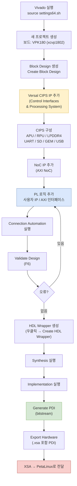
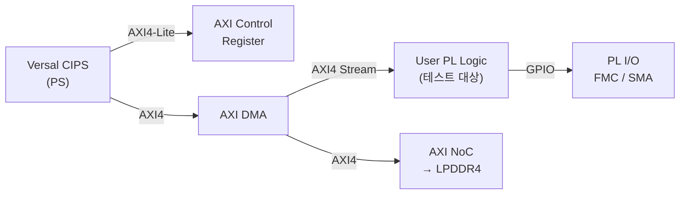

# Phase 3 — Vivado Design

> Vivado에서 VPK180용 블록 디자인을 생성하고, FPGA 로직을 추가한 뒤 XSA와 PDI를 생성한다.

## 체크리스트

- [ ] Vivado 2025.2 환경 소스
- [ ] VPK180 보드 파일 로드 확인
- [ ] Versal CIPS IP 구성 (APU, LPDDR4, Peripherals)
- [ ] 테스트 대상 PL 로직 추가
- [ ] NoC 연결 설정
- [ ] Synthesis / Implementation 완료
- [ ] XSA 파일 export
- [ ] PDI 생성 확인

---

## Vivado 디자인 플로우



---

## 프로젝트 생성

```tcl
# Vivado Tcl Console 또는 CLI
create_project vpk180_design ./vivado_project -part xcvp1802-lsvc4072-2MP-e-S
set_property board_part xilinx.com:vpk180:part0:1.0 [current_project]
```

또는 GUI:
1. File → New Project → RTL Project
2. Board: `VPK180` 검색 → 선택
3. Default Part: `xcvp1802-lsvc4072-2MP-e-S`

---

## Versal CIPS IP 구성

Block Design에서 `Versal CIPS` IP 추가 후 설정:

### APU 구성 (PS PMC → PS PL Interfaces)

| 항목 | 설정값 |
|------|--------|
| APU | Enable (Cortex-A72 ×2) |
| RPU | Enable (필요 시) |
| Frequency | APU: 1.1-1.2 GHz |

### LPDDR4 메모리

| 항목 | 설정값 |
|------|--------|
| 메모리 채널 | CH0, CH1, CH2 (3채널) |
| 데이터 폭 | 2×32-bit per channel |
| 용량 | 4GB per channel |
| 속도 | 4266 Mbps |
| 기준 클럭 | 200 MHz (Si570) |

### MIO 주변장치

| 기능 | MIO 핀 | 활성화 |
|------|---------|--------|
| UART0 | MIO42 (RX) / MIO43 (TX) | ✅ (콘솔) |
| SD1 | MIO51~58 | ✅ (부팅) |
| GEM0 | MIO26~45 (RGMII) | ✅ |
| USB0 | MIO0~12 | 필요 시 |
| QSPI | MIO0~7 | 필요 시 |

---

## NoC (AXI NoC) 연결

```
CIPS PS Master (M_AXI_FPD) ─── AXI NoC ─── DDR MC (LPDDR4 CH0)
                                        └─── PL Slave (S_AXI_0)
                                        └─── PL Master (M_AXI_0)
```

NoC IP 설정:
- **Number of AXI Slave Interfaces**: PS에서 NoC로의 연결 수
- **Number of AXI Master Interfaces**: NoC에서 LPDDR4로의 연결 수
- **DDR Address Region**: 0x0000_0000 ~ (LPDDR4 용량)

---

## PL 로직 추가

테스트 목적에 따라 아래 IP 중 선택하여 추가:



### 기본 검증용 IP (최소 구성)

```
- AXI GPIO: LED/Button 제어로 PL 동작 확인
- AXI BRAM Controller + BRAM: PS에서 PL 메모리 접근 테스트
- AXI ILA (Integrated Logic Analyzer): 신호 내부 분석
```

---

## XSA Export

```tcl
# Vivado Tcl Console
write_hw_platform -fixed -include_bit -force ./output/design_1_wrapper.xsa
```

GUI: File → Export → Export Hardware → Include Bitstream → Export

**출력 파일**: `design_1_wrapper.xsa`
→ Phase 4 PetaLinux 빌드에서 사용

---

## 리소스 사용량 참고

VPK180 (XCVP1802) 가용 리소스:

| 리소스 | 총량 |
|--------|------|
| LUT | ~2.07M |
| BRAM (36K) | ~1,872 |
| DSP58 | ~3,840 |
| UltraRAM (288K) | ~960 |
| GTM 트랜시버 | 140 (35 quads) |
| GTYP 트랜시버 | 28 (7 quads) |

---

## 참고

- [시스템 아키텍처 다이어그램](diagrams/system-architecture.drawio)
- [UG908 Vivado Programming and Debugging](https://docs.amd.com/r/en-US/ug908-vivado-programming-debugging)
- [AM011 Versal Technical Reference Manual](https://docs.amd.com/r/en-US/am011-versal-acap-trm)
