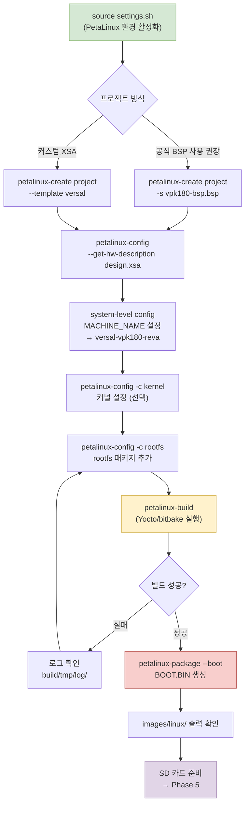
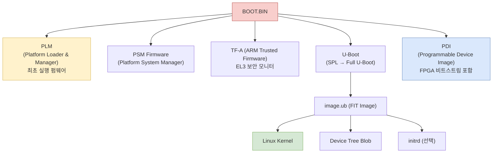

# Phase 4 — PetaLinux Build

> Vivado에서 생성된 XSA를 가져와 PetaLinux 프로젝트를 빌드하고 SD 부팅용 이미지를 생성한다.

## 체크리스트

- [ ] PetaLinux 환경 source
- [ ] VPK180 BSP 또는 XSA로 프로젝트 생성
- [ ] `petalinux-config --get-hw-description` 완료
- [ ] Machine name `versal-vpk180-reva` 확인
- [ ] 커널/rootfs 설정 완료
- [ ] `petalinux-build` 성공
- [ ] `petalinux-package --boot` 완료
- [ ] 출력 파일 4종 확인

---

## 빌드 플로우



---

## 1. 환경 활성화

```bash
source ~/petalinux/2025.2/settings.sh
echo $PETALINUX  # 확인
```

---

## 2. 프로젝트 생성

### 방법 A: 공식 VPK180 BSP 사용 (권장)

```bash
# AMD 다운로드 센터에서 VPK180 BSP 다운로드
# https://www.xilinx.com/support/download/index.html/content/xilinx/en/downloadNav/embedded-design-tools.html

petalinux-create project \
    -s xilinx-vpk180-v2025.2-final.bsp \
    -n vpk180-project

cd vpk180-project
```

### 방법 B: 커스텀 XSA (Vivado 자체 디자인)

```bash
petalinux-create project \
    --template versal \
    -n vpk180-project

cd vpk180-project
```

---

## 3. Hardware XSA 임포트

```bash
petalinux-config --get-hw-description /path/to/design_1_wrapper.xsa
```

**config 메뉴에서 확인/설정:**

```
DTG Settings →
    MACHINE_NAME = versal-vpk180-reva   ← VPK180 필수 설정
    
Subsystem AUTO Hardware Settings →
    Memory Settings → 자동 감지 확인
    
Image Packaging Configuration →
    Root filesystem type = EXT4 (SD/eMMC)
    Copy final images to tftpboot = 필요 시 활성화
```

---

## 4. 커널 설정

```bash
petalinux-config -c kernel
```

**권장 활성화 항목:**

| 메뉴 경로 | 옵션 | 이유 |
|-----------|------|------|
| Device Drivers → GPIO | GPIO sysfs interface | PL GPIO 테스트 |
| Device Drivers → DMA Engine | Xilinx AXI DMA | AXI DMA 드라이버 |
| Device Drivers → UIO | UIO platform driver | 사용자공간 IO |
| Networking → Ethernet | Xilinx GEM | Ethernet 드라이버 |

---

## 5. Rootfs 설정

```bash
petalinux-config -c rootfs
```

**권장 추가 패키지:**

```
Filesystem Packages →
    misc → packagegroup-petalinux-self-hosted    # 개발 도구
    base → devmem2                               # 메모리 접근 테스트
    libs → libmetal                              # Metal I/O 라이브러리
    
PetaLinux Package Groups →
    packagegroup-petalinux-benchmarks            # 벤치마크 도구
```

---

## 6. 빌드

```bash
# 전체 빌드 (약 1~3시간 소요 — 머신 성능에 따라 다름)
petalinux-build

# 병렬 빌드 (코어 수 지정)
petalinux-build -j 16
```

**빌드 실패 시 로그 확인:**

```bash
# 마지막 오류 확인
petalinux-build 2>&1 | tail -50

# 상세 로그
cat build/tmp/work/<machine>/<package>/*/temp/log.do_compile
```

---

## 7. 부트 이미지 패키징

```bash
# Versal용 BOOT.BIN 생성
# (PLM + PSM FW + TF-A (ATF) + U-Boot + PDI 포함)
petalinux-package --boot --u-boot

# WIC 이미지 생성 (SD 카드 직접 쓰기용, 선택)
petalinux-package --wic --wic-extra-args "-c xz"
```

---

## 8. 출력 파일 확인

빌드 완료 후 `images/linux/` 디렉토리:

| 파일 | 내용 | 필수 |
|------|------|------|
| `BOOT.BIN` | PLM + PSM FW + ATF + U-Boot + PDI | ✅ |
| `boot.scr` | U-Boot 부트 스크립트 | ✅ |
| `image.ub` | FIT 이미지 (커널 + DTB) | ✅ |
| `rootfs.tar.gz` | EXT4 루트 파일시스템 | ✅ |
| `rootfs.wic.xz` | 압축 WIC 이미지 (선택) | ○ |
| `system.dtb` | 장치 트리 바이너리 | 참고용 |

---

## Versal 부트 이미지 구조



---

## SD 카드 준비

```bash
# SD 카드 파티션 (예: /dev/sdb)
sudo fdisk /dev/sdb
# → n, p, 1, +500M (FAT32 부트)
# → n, p, 2, (나머지 ext4)
# → w

# 포맷
sudo mkfs.vfat -F 32 -n BOOT /dev/sdb1
sudo mkfs.ext4 -L rootfs /dev/sdb2

# 부트 파티션 파일 복사
sudo mount /dev/sdb1 /mnt/boot
sudo cp images/linux/BOOT.BIN /mnt/boot/
sudo cp images/linux/boot.scr /mnt/boot/
sudo cp images/linux/image.ub /mnt/boot/
sudo umount /mnt/boot

# rootfs 압축 해제
sudo mount /dev/sdb2 /mnt/rootfs
sudo tar xvf images/linux/rootfs.tar.gz -C /mnt/rootfs
sudo umount /mnt/rootfs
sync
```

---

## 참고

- [부트 플로우 다이어그램](diagrams/boot-flow.drawio)
- [UG1144 PetaLinux Tools Reference Guide](https://docs.amd.com/r/en-US/ug1144-petalinux-tools-reference-guide)
- [Versal Embedded Design Tutorial](https://xilinx.github.io/Embedded-Design-Tutorials/)
