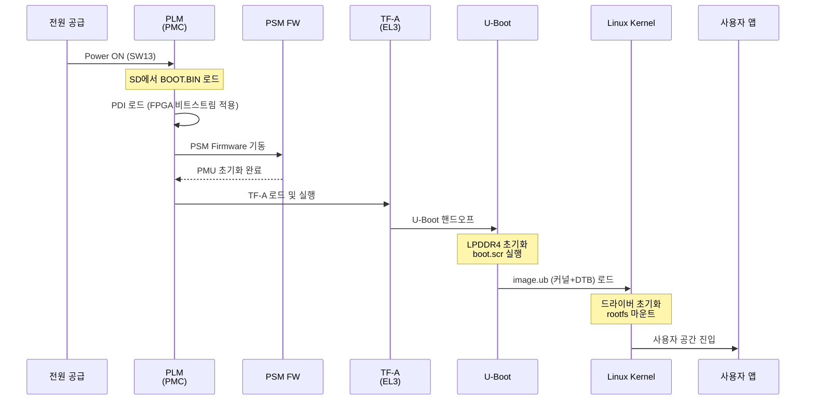
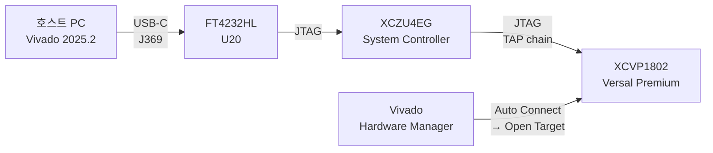

# Phase 5-6 — Boot & Test

> SD 카드로 VPK180을 부팅하고 FPGA 로직의 동작을 확인한다.

## 체크리스트

- [ ] SW1 SD 부팅 모드 설정
- [ ] USB-C J369 연결
- [ ] UART 콘솔 열기 (115200 8N1)
- [ ] 전원 ON → U-Boot 메시지 확인
- [ ] Linux 부팅 완료 확인
- [ ] PL 클럭/리셋 상태 확인
- [ ] AXI 주변장치 접근 테스트
- [ ] FPGA 기능 테스트 실행

---

## 부트 시퀀스



---

## 1. 부트 전 설정

### SW1 — SD 부팅 모드

| SW1[1] | SW1[2] | SW1[3] | SW1[4] | 모드 |
|--------|--------|--------|--------|------|
| ON | **OFF** | **OFF** | **OFF** | SD1 (3.0) 부팅 |

### 케이블 연결

```
호스트 PC ─── USB-C ──→ J369 (VPK180)
           USB-C 연결 시 2개 COM 포트 생성:
           - COM port 1 (lower): JTAG
           - COM port 2 (higher): UART
```

### UART 터미널 열기

```bash
# Linux
minicom -D /dev/ttyUSB1 -b 115200

# 설정: 115200 8N1, No flow control
```

---

## 2. 전원 ON 및 부팅

```bash
# SW13 → ON
# UART 터미널에서 PLM 메시지 확인:

[    0.000] PLM Initialization Start
[    0.020] PLM Version: 2025.2.0
[    0.030] Loading PDI from SD
...
U-Boot 2025.01 (PetaLinux 2025.2)
DRAM: 12 GiB
...
Starting kernel ...

[    0.000000] Booting Linux on physical CPU 0x0000000000 [0x410fd083]
[    0.000000] Linux version 6.x.x ...
```

---

## 3. FPGA (PL) 동작 확인

Linux 부팅 후:

### PL 클럭 및 리셋 확인

```bash
# PL 클럭 상태 확인
cat /sys/class/clk/pl_clk0/rate

# PL 리셋 해제 확인 (device tree 기반)
cat /proc/device-tree/amba/...
```

### AXI 주변장치 확인

```bash
# dmesg로 드라이버 로딩 확인
dmesg | grep -i "xilinx\|axi\|pl\|fpga"

# /dev/ 아래 PL 장치 확인
ls /dev/uio*   # UIO 장치
ls /dev/xdma*  # XDMA 장치 (해당 시)
```

### devmem2로 직접 레지스터 접근

```bash
# AXI GPIO 기준 주소 (디자인에 따라 다름)
# Vivado Address Editor에서 확인한 베이스 주소 사용
BASE_ADDR=0xA0000000

# 레지스터 읽기
devmem2 ${BASE_ADDR} w

# 레지스터 쓰기 (LED 켜기 예시)
devmem2 ${BASE_ADDR} w 0x00000001
```

---

## 4. JTAG 부팅 (개발/디버그용)

SW1을 JTAG 모드로 변경 후 Vivado에서 직접 PDI 로드:



```tcl
# Vivado Tcl Console
open_hw_manager
connect_hw_server -url localhost:3121
open_hw_target
set_property PROGRAM.FILE {./images/linux/BOOT.BIN} [get_hw_devices xcvp1802_0]
program_hw_devices [get_hw_devices xcvp1802_0]
```

또는 PetaLinux JTAG 부팅:

```bash
petalinux-boot --jtag --kernel --fpga --bitstream images/linux/BOOT.BIN
```

---

## 5. 테스트 시나리오

### 기본 시스템 테스트

```bash
# 1. CPU 정보 확인
cat /proc/cpuinfo | grep "model name"
# → ARM Cortex-A72

# 2. 메모리 확인
free -h
# → 총 ~12GB LPDDR4

# 3. 네트워크 확인
ip link show eth0
ping -c 3 8.8.8.8

# 4. SD 파티션 확인
lsblk
df -h
```

### FPGA PL 통신 테스트

```bash
# AXI GPIO 테스트 (sysfs)
echo 0 > /sys/class/gpio/export  # GPIO 번호는 디자인에 따라 다름
echo out > /sys/class/gpio/gpio0/direction
echo 1 > /sys/class/gpio/gpio0/value

# BRAM 읽기/쓰기 테스트
devmem2 0xA0010000 w 0xDEADBEEF    # BRAM 기본 주소 (디자인 확인 필요)
devmem2 0xA0010000                  # 읽기 확인: 0xDEADBEEF
```

### 메모리 성능 테스트

```bash
# mbw 설치 또는 직접 테스트
dd if=/dev/zero of=/dev/null bs=1M count=1000
```

---

## 6. 디버깅 팁

| 증상 | 원인 | 해결 방법 |
|------|------|-----------|
| PLM에서 멈춤 | PDI 로드 실패 | SD 카드 재준비, BOOT.BIN 재생성 |
| U-Boot에서 멈춤 | LPDDR4 초기화 실패 | XSA 메모리 설정 확인 |
| 커널 panic | rootfs 마운트 실패 | ext4 파티션 재포맷 |
| PL 장치 없음 | PDI에 PL 로직 미포함 | `--include-bit` 옵션 확인 |
| AXI 접근 오류 | 주소 불일치 | Vivado Address Editor 재확인 |

---

## 참고

- [JTAG 체인 다이어그램](diagrams/jtag-chain.drawio)
- [부트 플로우 다이어그램](diagrams/boot-flow.drawio)
- [JTAG 디버거 목록](../jtag/supported-debuggers.md)
- [UG908 Vivado Programming and Debugging](https://docs.amd.com/r/en-US/ug908-vivado-programming-debugging)
