# ARM Core · Peripheral → DDR 데이터 저장 방법

> 대상: VPK180 (XCVP1802 Versal Premium)  
> **⚠️ Versal vs ZynqMP 핵심 차이**: Versal에는 FPD ZDMA 없음, PS-PL HP 포트 없음 → 모두 NoC 경유

## 아키텍처 요약

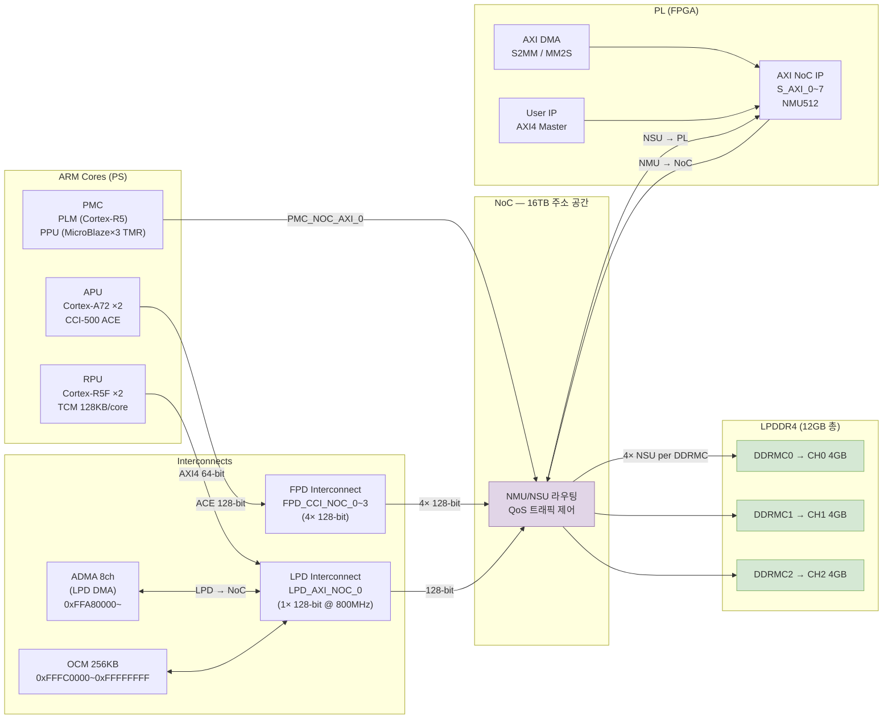

---

## 방법 1: Host PC → VPK180 DDR (외부 전송)

### 1-1. Ethernet (GEM) — 가장 범용적

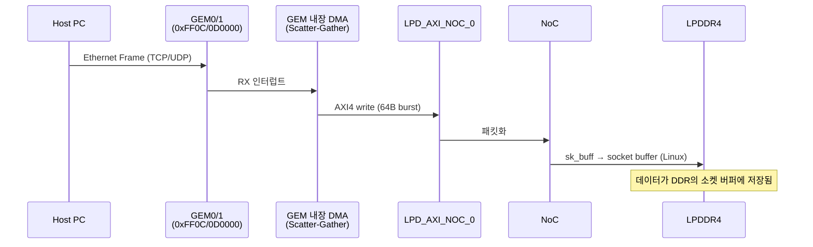

**구현 방법:**
```bash
# VPK180에서 (Linux)
nc -l -p 9999 > /tmp/received_data.bin     # 수신 대기

# Host PC에서
cat data.bin | nc 192.168.x.x 9999        # 전송
scp large_file.bin user@vpk180:/mnt/ddr/  # SCP
```

**특징:**
- 대역폭: ~1 Gbps (GEM 하드웨어 한계), 실효 ~800 Mbps
- GEM DMA ring buffer → Linux sk_buff → DDR (copy 최소화 가능)
- `sendfile()` + `mmap()` 조합으로 zero-copy 가능

---

### 1-2. JTAG (XSDB) — 디버그/소량 데이터

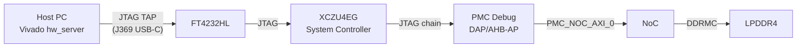

**구현 방법:**
```tcl
# XSDB Tcl 콘솔 (Vivado/Vitis에서 실행)
connect
targets
target 1   # XCVP1802 타겟 선택

# 직접 DDR 쓰기
mwr -size w 0x00001000 0xDEADBEEF

# 파일을 DDR에 로드
dow -data ./data.bin 0x10000000

# DDR 읽기 확인
mrd -size w 0x00001000 1
```

**특징:**
- 대역폭: 매우 느림 (~수 MB/s)
- 장점: OS 없이, 부팅 전 상태에서도 사용 가능
- 장점: APU/RPU 리셋 상태에서도 PMC Debug를 통해 DDR 접근 가능

---

### 1-3. USB (DWC3) — Host PC → VPK180 USB Gadget

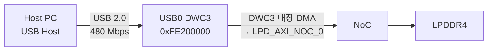

**Linux에서 USB Gadget 설정:**
```bash
# VPK180 Linux (USB mass storage gadget)
modprobe g_mass_storage file=/dev/mmcblk0 stall=0

# 또는 USB network gadget (RNDIS)
modprobe g_ether
# → Host에서 USB 네트워크 인터페이스로 접근
```

**특징:**
- 대역폭: ~400 Mbps (USB 2.0 실효)
- USB mass storage: 표준 파일시스템 접근
- USB CDC/RNDIS: 네트워크처럼 사용

---

### 1-4. SD 카드 (SDHCI) — 물리적 전송

```
Host PC → SD 카드 기록 → VPK180 SD슬롯 삽입 → SDHCI DMA → PMC_NOC_AXI_0 → DDR
```

```bash
# VPK180 Linux에서 SD 카드 데이터 DDR로 복사
dd if=/dev/mmcblk1p1 of=/dev/mem bs=1M seek=256  # 직접 메모리 매핑 (위험)
cp /mnt/sdcard/data.bin /mnt/ddr/data.bin          # 파일시스템 경유 (권장)
```

**특징:**
- SDHCI DMA → PMC_NOC_AXI_0 경유 (ZynqMP의 SD DMA와 경로 다름)
- 물리적 접근 필요 (자동화 어려움)

---

### 1-5. PCIe DMA — 고속 대용량 (PL 설계 필요)

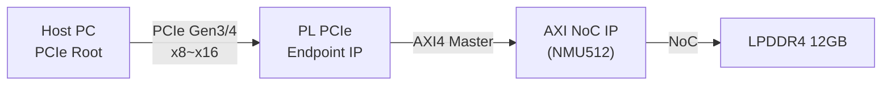

**특징:**
- 대역폭: PCIe Gen3 x8 = ~8 GB/s, Gen4 x16 = ~32 GB/s
- PL에 PCIe Endpoint IP + DMA 설계 필요 (XDMA IP 등)
- VPK180 FMC+나 GTM 트랜시버 활용
- 가장 높은 Host→DDR 대역폭

---

## 방법 2: APU (Cortex-A72) → DDR

### 2-1. CPU 직접 쓰기 (캐시 경유)

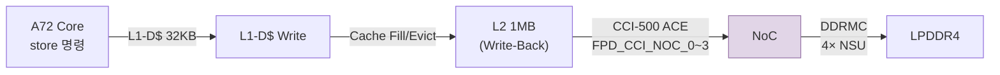

```c
// Linux userspace
#include <sys/mman.h>
// malloc → 가상주소 → MMU → 물리 LPDDR4
char *buf = malloc(1024 * 1024 * 100);  // 100MB
memcpy(buf, src, size);                  // CCI-500 → NoC → DDR

// 캐시 일관성 보장 (DMA 전달 전 필요 시)
__builtin___clear_cache(buf, buf + size);  // gcc cache flush
```

**성능 특성:**
- A72 Store: ~4 Byte/cycle
- CCI-500 128-bit 버스: 이론 최대 ~51 GB/s (FPD_CCI_NOC_0~3 합산)
- 실제 LPDDR4 대역폭 한계: ~21 GB/s per DDRMC
- **Write-Back 캐시**: L2에 누적 후 eviction 시 NoC에 128-bit burst

---

### 2-2. ADMA (Linux dmaengine API) — CPU-free 대용량 전송

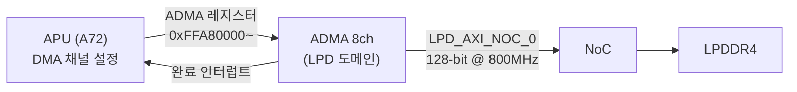

```c
// Linux kernel driver (dmaengine)
#include <linux/dmaengine.h>
#include <linux/dma-mapping.h>

struct dma_chan *chan = dma_request_chan(dev, "tx");
dma_addr_t src_dma = dma_map_single(dev, src_buf, len, DMA_TO_DEVICE);
dma_addr_t dst_dma = dma_map_single(dev, dst_buf, len, DMA_FROM_DEVICE);

struct dma_async_tx_descriptor *desc = dmaengine_prep_dma_memcpy(
    chan, dst_dma, src_dma, len, DMA_PREP_INTERRUPT);

dmaengine_submit(desc);
dma_async_issue_pending(chan);
wait_for_completion(&cmp);
```

**특징:**
- CPU 개입 없이 메모리↔메모리 전송
- ADMA 채널: 8개 독립 채널 (병렬 사용 가능)
- LPD_AXI_NOC_0 경유 → DDRMC
- Scatter-Gather 지원 (비연속 메모리 블록 전송)

---

### 2-3. GEM DMA 수신 (Ethernet 데이터)

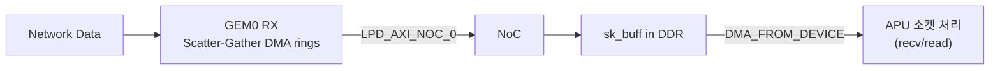

```c
// 소켓 버퍼는 이미 DDR에 있음 (GEM DMA가 직접 기록)
// APU는 데이터 복사 없이 포인터만 이동 (zero-copy 가능)
int fd = socket(AF_INET, SOCK_DGRAM, 0);
ssize_t n = recv(fd, ddr_buf, BUF_SIZE, 0);  // 이미 DDR에 있는 데이터 읽기
```

---

### 2-4. mmap + 직접 물리 주소 접근 (Bare-metal / 테스트)

```c
// Linux userspace devmem2 또는 직접 mmap
#include <sys/mman.h>
int fd = open("/dev/mem", O_RDWR | O_SYNC);

// DDR 물리 주소 0x10000000 매핑
void *ddr = mmap(NULL, 0x1000000, PROT_READ|PROT_WRITE, MAP_SHARED, fd, 0x10000000);
((uint32_t*)ddr)[0] = 0xDEADBEEF;  // DDR에 직접 쓰기

// 또는 devmem2 사용
// devmem2 0x10000000 w 0xDEADBEEF
```

---

## 방법 3: RPU (Cortex-R5F) → DDR

### 3-1. CPU 직접 쓰기 (비캐시 또는 캐시 경유)

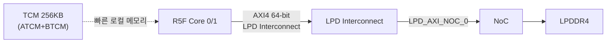

```c
// RPU bare-metal (XilinxStandalone BSP)
// DDR 주소 직접 쓰기
volatile uint32_t *ddr_ptr = (uint32_t*)0x00001000;  // DDR base
*ddr_ptr = 0xDEADBEEF;

// MPU (메모리 보호 유닛) 설정 필요 — DDR 영역을 캐시가능/비캐시가능으로 설정
// XilinxStandalone의 xil_io.h 사용:
Xil_Out32(0x00001000, 0xDEADBEEF);
uint32_t val = Xil_In32(0x00001000);
```

---

### 3-2. ADMA (RPU에서 DMA 제어)

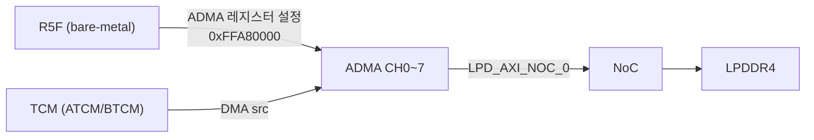

```c
// RPU에서 ADMA 직접 제어 (bare-metal)
// XilinxStandalone: xzdma.h
XZDma dma;
XZDma_Config *cfg = XZDma_LookupConfig(XPAR_XZDMA_0_DEVICE_ID);
XZDma_CfgInitialize(&dma, cfg, cfg->BaseAddress);
XZDma_SetMode(&dma, FALSE, XZDMA_NORMAL_MODE);

// TCM → DDR 전송
XZDma_Transfer xfer = {
    .SrcAddr = (uint64_t)(uintptr_t)tcm_buffer,  // ATCM 주소
    .DstAddr = 0x00100000,                         // DDR 목적지
    .Size    = 4096,
    .SrcCoherent = 1,
    .DstCoherent = 1,
};
XZDma_Start(&dma, &xfer, 1);
while (XZDma_ChannelState(&dma) == XZDMA_BUSY);
```

**특징:**
- TCM → ADMA → LPD_AXI_NOC_0 → NoC → DDR
- R5F CPU는 DMA 완료 대기 중 다른 작업 가능
- RPU는 DDR에 직접 쓰는 것보다 TCM→ADMA 패턴이 성능 좋음 (TCM은 한 사이클 접근)

---

### 3-3. RPU-APU 공유 메모리 (OpenAMP/RPMsg)

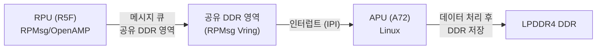

```bash
# Linux (APU)에서 RPMsg 채널 열기
modprobe rpmsg_char
echo "start" > /sys/class/remoteproc/remoteproc0/state

# RPMsg를 통해 R5F와 통신
# 데이터는 공유 DDR 영역을 통해 교환
```

---

## 방법 4: PL (FPGA) → DDR

### 4-1. AXI4 Master IP → AXI NoC IP → DDR (기본 패턴)

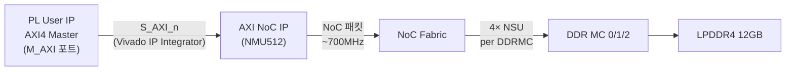

**Vivado IP Integrator 연결:**
```
PL_IP.M_AXI → axi_noc_0.S_AXI_0
axi_noc_0.CH0_DDR4_0 → (external: LPDDR4 pins)
axi_noc_0 (CIPS inputs): FPD_CCI_NOC_0~3, LPD_AXI_NOC_0, PMC_NOC_AXI_0
```

---

### 4-2. AXI DMA (S2MM) — 스트림 데이터를 DDR에 캡처

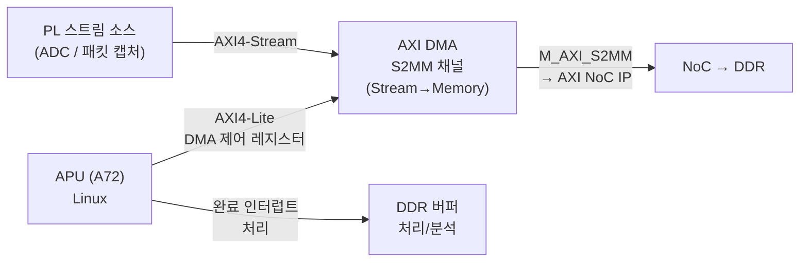

```python
# Linux userspace (xilinx-dma-proxy 또는 UIO)
import mmap, os

# AXI DMA 레지스터 설정 (APU에서)
dma_fd = open('/dev/uio0', 'r+b', buffering=0)
dma_regs = mmap.mmap(dma_fd.fileno(), 0x1000)

# DDR 버퍼 할당
buf_fd = open('/dev/udmabuf0', 'r+b', buffering=0)
ddr_buf = mmap.mmap(buf_fd.fileno(), BUF_SIZE)

# S2MM 시작 (DMA → DDR)
dma_regs[0x30:0x34] = (0x00001).to_bytes(4, 'little')  # S2MM control
dma_regs[0x48:0x50] = phys_addr.to_bytes(8, 'little')  # DDR 목적지 주소
dma_regs[0x58:0x5C] = BUF_SIZE.to_bytes(4, 'little')   # 길이 → DMA 시작
```

---

### 4-3. CDMA — PL 내 DDR-to-DDR 고속 이동

```c
// CDMA는 DDR 내 블록 이동에 최적화
// PL의 CDMA IP → AXI NoC → DDRMC
XAxiCdma_BdRingMemCalc(&cdma, bd_count);
XAxiCdma_SimpleTransfer(&cdma, src_ddr_addr, dst_ddr_addr, size, NULL, NULL);
```

---

## 방법 5: PMC/PLM → DDR (부팅/보안)

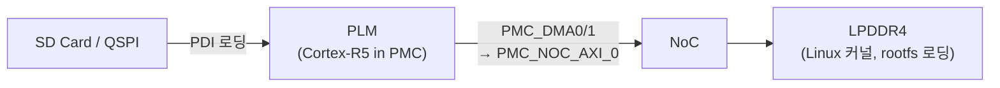

- PLM이 부팅 시 SD/QSPI의 PDI에서 커널 이미지를 DDR로 복사
- PMC_NOC_AXI_0: 128-bit @ 400MHz (보안 트랜잭션)
- 사용자 코드에서 직접 제어 불가 (PLM 전용)

---

## 전송 방법 비교표

| 방법 | 경로 | 최대 대역폭 | CPU 개입 | 사용 시나리오 |
|------|------|------------|---------|--------------|
| A72 직접 쓰기 (캐시) | CCI-500 → FPD_CCI_NOC_0~3 | ~51 GB/s (이론) | 높음 | 범용 메모리 할당 |
| ADMA (LPD DMA) | LPD_AXI_NOC_0 | ~12.8 GB/s | 낮음 | CPU-free 대용량 |
| R5F 직접 쓰기 | LPD_AXI_NOC_0 | ~6.4 GB/s | 높음 | 실시간 제어 데이터 |
| R5F ADMA | LPD_AXI_NOC_0 | ~12.8 GB/s | 낮음 | RT 데이터 → DDR |
| PL AXI4 Master | AXI NoC NMU512 | ~128 GB/s (NMU 합산) | 없음 | 고속 데이터 수집 |
| PL AXI DMA S2MM | AXI NoC NMU512 | ~10-20 GB/s | 낮음 | 스트림 캡처 |
| GEM DMA (Ethernet) | LPD_AXI_NOC_0 | ~1 Gbps (외부 제한) | 낮음 | Host→DDR 네트워크 전송 |
| USB DWC3 DMA | LPD_AXI_NOC_0 | ~480 Mbps (USB 제한) | 낮음 | Host→DDR USB 전송 |
| SD SDHCI DMA | PMC_NOC_AXI_0 | ~200 MB/s (SD 제한) | 낮음 | 파일 시스템 I/O |
| JTAG XSDB mwr | PMC Debug DAP | ~수 MB/s | 높음 | 디버그 전용 |
| PCIe DMA (PL) | AXI NoC NMU | ~8-32 GB/s | 낮음 | Host 고속 DMA |

---

## 주요 설계 패턴

### 패턴 A: 고속 스트림 캡처 (PL → DDR → APU 분석)

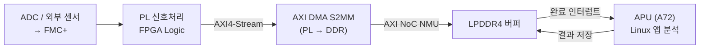

### 패턴 B: APU 제어 + RPU 실시간 처리

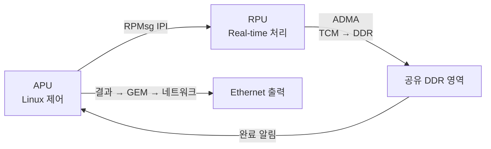

### 패턴 C: Host PC에서 대용량 데이터 주입

```
Host PC ──Ethernet──→ GEM0 DMA → LPD_AXI_NOC_0 → NoC → LPDDR4 CH0
                  또는
Host PC ──PCIe──────→ PL DMA → AXI NoC NMU → NoC → LPDDR4 CH0/1/2
```

---

## 참고

- [ARM-DDR 블록 다이어그램](diagrams/arm-ddr-interconnect.drawio)
- [AMD AM011 Versal TRM](https://docs.amd.com/r/en-US/am011-versal-acap-trm)
- [Versal Cache Coherency Wiki](https://xilinx-wiki.atlassian.net/wiki/spaces/A/pages/2535292995/Versal+Cache+Coherency)
- [Embedded Design Tutorial — CIPS/NoC](https://xilinx.github.io/Embedded-Design-Tutorials/docs/2022.1/build/html/docs/Introduction/Versal-EDT/docs/2-cips-noc-ip-config.html)
