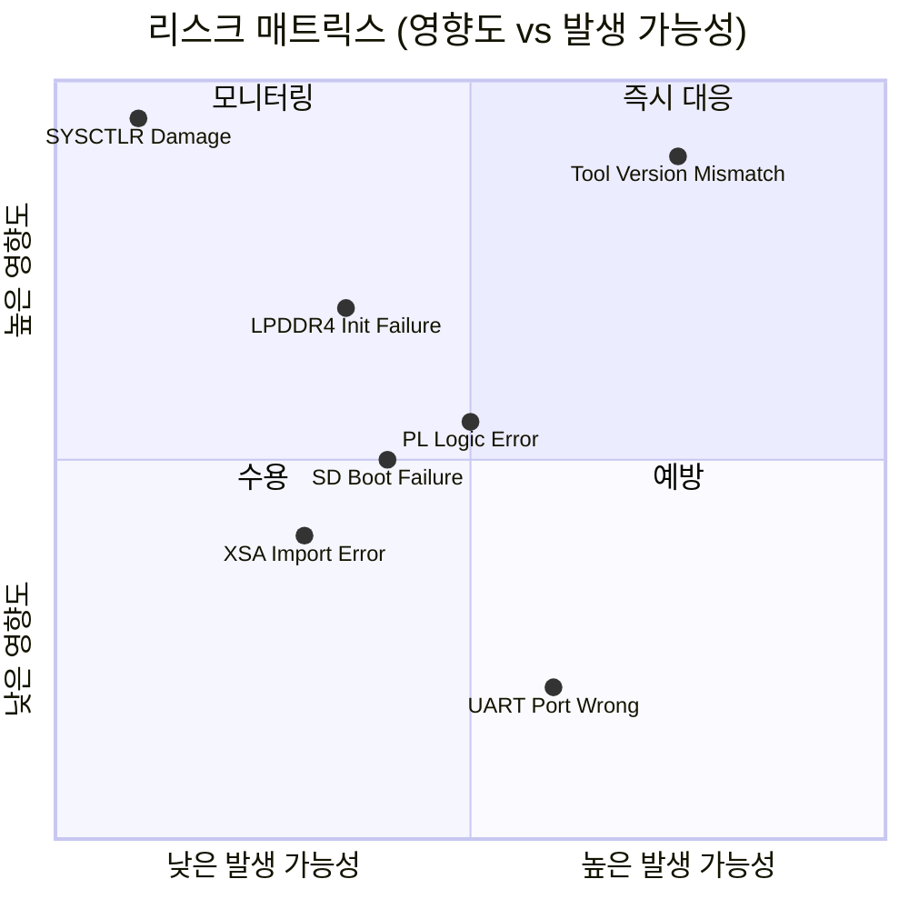
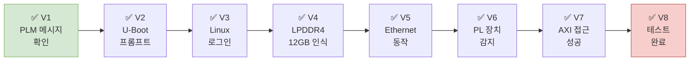

# Codex 점검 결과 — VPK180 Bringup Readiness Review

> 작성일: 2026-05-31  
> 검토 범위: VPK180 FPGA 바이너리 탑재 + PetaLinux 기반 테스트 전체 플로우

---

## 요약

| 영역 | 상태 | 비고 |
|------|------|------|
| 하드웨어 준비 | 🔵 계획됨 | 스위치/점퍼 설정 문서화 완료 |
| 소프트웨어 환경 | 🔵 계획됨 | 툴 버전 확정 (2025.2) |
| Vivado 디자인 | 🔵 계획됨 | 사용자 PL 로직 미정 |
| PetaLinux 빌드 | 🔵 계획됨 | BSP 다운로드 필요 |
| 부팅 검증 | 🔵 계획됨 | — |
| 테스트 시나리오 | ⚠️ 미정 | 테스트 목표 구체화 필요 |

---

## 1. 전제조건 점검

### 1.1 하드웨어 체크

| 항목 | 필요 | 상태 |
|------|------|------|
| VPK180 보드 | ✅ 필수 | — |
| ATX 12V PSU (6+2 핀) | ✅ 필수 | — |
| USB-C 케이블 (J369용) | ✅ 필수 | — |
| microSD 카드 (16GB+) | ✅ 필수 | — |
| 호스트 PC (Ubuntu 22.04) | ✅ 필수 | — |
| SmartLynq+ 또는 JTAG-HS3 | ⚠️ 권장 | FT4232 온보드로 대체 가능 |

### 1.2 소프트웨어 체크

| 항목 | 버전 | 상태 |
|------|------|------|
| Vivado Design Suite | 2025.2 | 설치 필요 |
| PetaLinux | 2025.2 | 설치 필요 |
| VPK180 BSP 파일 | 2025.2 | 다운로드 필요 |
| FTDI/USB 드라이버 | — | Vivado 설치 시 포함 |

---

## 2. 리스크 매트릭스



---

## 3. 주요 리스크 및 대응

### 🔴 Critical

#### R-01: 툴 버전 불일치
- **리스크**: PetaLinux와 Vivado 버전이 다를 경우 빌드 실패 또는 부팅 불가
- **발생 가능성**: 높음 (팀원 간 버전 혼용 가능)
- **영향도**: 매우 높음 (전체 플로우 재작업 필요)
- **대응**: 팀 공통 버전 `2025.2` 고정, CI에서 버전 체크 추가

#### R-02: System Controller 펌웨어 손상
- **리스크**: XCZU4EG SC 펌웨어 교체 시 보드 영구 손상
- **발생 가능성**: 낮음 (명시적 조작 없이 발생 안 함)
- **영향도**: 매우 높음 (보드 교체 필요)
- **대응**: SC 펌웨어 관련 문서 접근 제한, SW11/SW16 조작 금지 정책

### 🟡 High

#### R-03: LPDDR4 초기화 실패
- **리스크**: CIPS IP에서 LPDDR4 설정 오류 시 U-Boot/Linux에서 메모리 인식 불가
- **대응**: VPK180 공식 BSP의 검증된 설정 사용, 커스텀 시 DDR 교정(calibration) 로그 확인

#### R-04: PL 로직 미완성 상태로 PDI 생성
- **리스크**: 불완전한 PL 로직 포함 시 부팅 중단 가능
- **대응**: 초기 빌드 시 `PS only` (PL 비어있는 상태)로 부팅 먼저 검증

### 🟢 Medium

#### R-05: SD 부팅 파티션 오류
- **대응**: `petalinux-package --wic` 생성 이미지 사용 (자동 파티셔닝)

#### R-06: PL 장치 주소 불일치
- **대응**: Vivado Address Editor에서 정확한 주소 확인 후 디바이스 트리 자동 생성 확인

---

## 4. 빌드 전 확인 체크리스트

### 4.1 Vivado XSA 품질 점검

```
□ PS 구성: APU Cortex-A72 활성화
□ PS 구성: LPDDR4 CH0/CH1/CH2 모두 활성화 (12GB 인식)
□ PS 구성: MIO UART0 (MIO42/43) 활성화 — 콘솔 필수
□ PS 구성: MIO SD1 활성화 — SD 부팅 필수
□ PS 구성: GEM0 RGMII 활성화 — 네트워크
□ PL: 미사용 입출력 핀 처리 (tie-off 또는 open)
□ NoC: PS ↔ PL 경로 연결 확인
□ 주소 할당: PL IP 주소 충돌 없음 확인
□ Validate Design 경고 없음
□ XSA: 비트스트림 포함 export
```

### 4.2 PetaLinux 빌드 전 확인

```
□ MACHINE_NAME = versal-vpk180-reva
□ Root filesystem type = EXT4
□ XSA 파일 경로 절대 경로로 지정
□ /bin/sh → bash (dash 아님)
□ PetaLinux root 설치 아님
□ 디스크 여유 공간 100GB 이상
```

### 4.3 SD 카드 준비 확인

```
□ 파티션 1 (FAT32): BOOT.BIN, boot.scr, image.ub 복사 완료
□ 파티션 2 (EXT4): rootfs.tar.gz 압축 해제 완료
□ sync 실행 후 SD 카드 안전 제거
□ SD 카드 J301 슬롯에 완전히 삽입 확인
```

---

## 5. 단계별 검증 포인트



| 검증 포인트 | 확인 방법 | 예상 결과 |
|------------|-----------|-----------|
| V1 PLM 메시지 | UART 터미널 | `PLM Version: 2025.2.0` 출력 |
| V2 U-Boot 프롬프트 | UART 터미널 | `Hit any key to stop autoboot:` 또는 자동 부팅 |
| V3 Linux 로그인 | UART 터미널 | `versal-vpk180-reva login:` |
| V4 메모리 인식 | `free -h` | `Mem: ~12Gi` |
| V5 Ethernet | `ip link show eth0` | `state UP` |
| V6 PL 장치 | `dmesg \| grep xilinx` | AXI 장치 감지 로그 |
| V7 AXI 접근 | `devmem2 <주소>` | 레지스터 값 정상 읽기 |
| V8 테스트 완료 | 테스트 스크립트 | PASS |

---

## 6. 미결 항목 (Action Items)

| # | 항목 | 담당 | 기한 |
|---|------|------|------|
| A-01 | 테스트 목표 및 기능 스펙 확정 | 팀 | — |
| A-02 | AMD 공식 VPK180 BSP 2025.2 다운로드 | — | — |
| A-03 | 호스트 Linux 머신 확보 및 Ubuntu 22.04 설치 | — | — |
| A-04 | ATX PSU 및 USB-C 케이블 준비 | — | — |
| A-05 | PL 로직 설계 범위 결정 (IP 목록) | — | — |
| A-06 | LPDDR4 용량 사용 계획 (12GB 중 어떻게 사용) | — | — |
| A-07 | 테스트 자동화 스크립트 작성 계획 | — | — |

---

## 7. 권고사항

### 7.1 단계적 접근 권장

```
1단계: PS only 부팅 (PL 없이) → 기본 시스템 검증
2단계: PL에 AXI GPIO만 추가 → PL 통신 검증
3단계: 목표 FPGA 로직 추가 → 기능 테스트
```

### 7.2 버전 관리

- XSA, BOOT.BIN, image.ub는 생성 Vivado/PetaLinux 버전 태깅 필수
- Git에 바이너리 직접 커밋 금지 → Git LFS 또는 별도 스토리지 사용

### 7.3 HSDP 활성화 고려

- SmartLynq+ 사용 시 HSDP 모드로 JTAG 속도 대폭 향상 가능
- Vivado CIPS IP → Debug → HSDP → Aurora 활성화
- 참고: [supported-debuggers.md](../jtag/supported-debuggers.md)

---

## 참고 문서

- [00-overview.md](00-overview.md) — 전체 작업 목록
- [UG1582](https://docs.amd.com/r/en-US/ug1582-vpk180-eval-bd) — VPK180 Board User Guide
- [UG1144](https://docs.amd.com/r/en-US/ug1144-petalinux-tools-reference-guide) — PetaLinux Reference Guide
